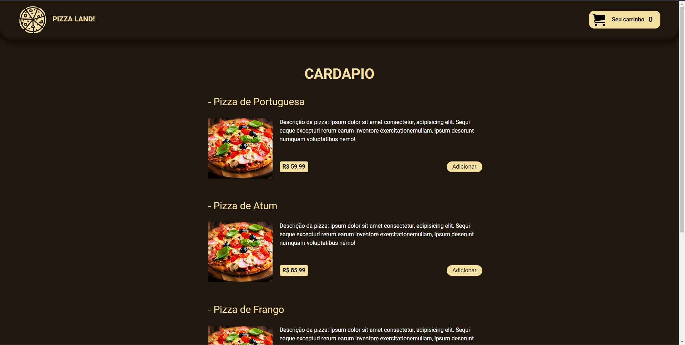
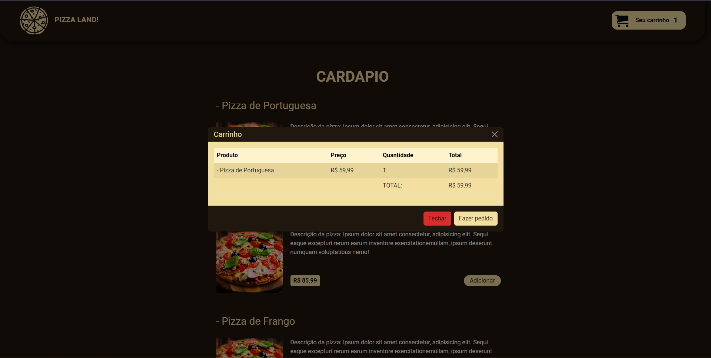

  <h1>Cardapio de Pizza e Função de Carrinho!</h1>

## 📱 Layout

<!-- "Colocar sua imagens demo aqui" -->

  
  

## ✔️ Técnicas e tecnologias utilizadas

Lista de tecnologias que foram usadas nesse projeto:

 

### Frontend

<!-- "Colocar suas dependencias aqui"
"Site para pegar os icones das sua badge (https://shields.io/) " -->

## 🛠️ Abrir e rodar o projeto

Para abrir e rodar o projeto, entre na pasta web do frontend execute `npm install` para instalar as dependências e `npm run dev` para iniciar o projeto.

Depois, acesse <a href="http://localhost:5173/">http://localhost:5173/</a> no seu navegador.

## 📚 Mais informações

Entre em contato pelo [linkedin](https://www.linkedin.com/in/daniel-tinois-7338a2244/).<!-- "coloque o link do seu linkedin no parenteses" -->

  <small>Daniel Tinois - 2023</small>

